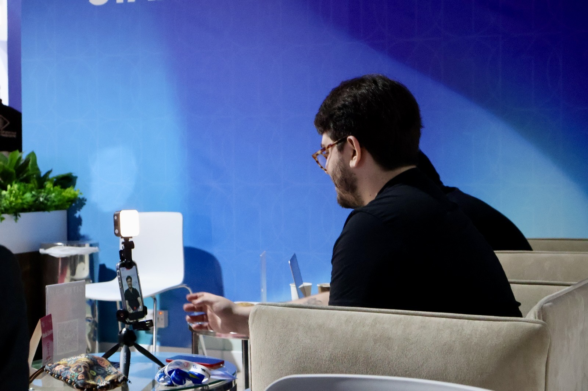


Technology journalist with ten years of experience, currently editor at **Canaltech** — one of Brazil's largest technology outlets. Driven by the curiosity that defines good journalism, he expanded his work into data science and computing, combining journalistic investigation with analytical thinking to tell increasingly data-driven stories.


Based in Rio de Janeiro, he covers topics such as artificial intelligence, innovation, startups, privacy, digital security, connected health, fintechs, education, sustainability, and policy.

He has participated in international coverage in Buenos Aires, Paris, Dubai (GITEX Global and Expand North Star), Las Vegas (AWS re:Invent), as well as domestic events such as Web Summit Rio, Rio Innovation Week, and Rock in Rio.

He also works across different media formats, with appearances on **CNN Brasil**, and as host of the **Canaltech Podcast**, **Tecnocast** (Tecnoblog), and **Porta 101** (Canaltech).


Follow my work →


## Skills

### Journalism, Communication & Content


Writing and editing
SEO
Content strategy
Investigative reporting
Photography and audiovisual production
Media relations
Team management


### Data & Technology


Python
HTML & CSS
Data analysis and visualization
Google Analytics
Metrics and KPIs


### Languages


English (fluent)
Spanish (intermediate)
Chinese (basic)


---

## Experience




Editorial content management with a focus on performance optimization (SEO). Production of reports, analyses, and content in text, video, podcast, and TV formats covering technology, AI, and the market. Coverage of national and international events. Team coordination and reporting with KPI analysis. Awarded <strong>Canaltech's Outstanding Professional</strong> in 2024.



Specialized coverage of technology, AI, and innovation. Reports, analyses, and strategic content on technology, market, cybersecurity, and telecom. Podcast hosting and coverage of national events.



Coverage of technology, gadgets, and innovation. News production and feature reporting.



Writing SEO-focused evergreen content on technology and entertainment for TechTudo.



Content management and production for LinkedIn and corporate newsletters. B2B client servicing across different sectors, including clients such as BIC, Lorinvest, Patrimar, and Repsol Sinopec Brasil.



Writing SEO-focused evergreen content on technology and entertainment for Olhar Digital.



Specialized coverage of technology and business. Production of investigative reports, analyses, and SEO-optimized news. Source relationship management, event coverage, and podcast and video hosting. Content metrics and performance analysis.



Digital content production about technology. Writing and proofreading, story pitching, video and photo editing. Event coverage and reviews of mobile devices and apps.



Metrics analysis and content strategy at the experimental newsroom of Universidade Veiga de Almeida. Development of the Editorial Style Guide and the agency's graphic design. Member of the Editorial Board.



News clipping and monitoring for institutions such as Banco Central do Brasil, Banco do Brasil, and Eletrobras.



Journalistic coverage of the Apple ecosystem and technology.




---

## Education




Graduate degree in progress, with a focus on data science and Full Stack Development.



Specialization in digital strategy, SEO, and analytics.



Graduated with academic distinction and honorable mention as the best thesis in the program. Thesis titled <em>"Technology coverage in Brazil: a case study on TechTudo"</em>, approved with highest honors.



Technical education with a foundation in electronics, mechanics, and programming.




### Additional Training


Data Science
Science Communication (Fiocruz)
Photography
Audiovisual Production


---

## Publications

Co-author of two book chapters and participant in scientific initiation projects on political communication and electoral behavior, with presentations at UVA's Research Seminars (2019 and 2020).

- *"Internet and the Press: a reflection on journalism theories in the digital age"* (2019)
- *"The reportage book and the Russian Revolution: a brief analysis of 'Ten Days That Shook the World'"* (2017)
